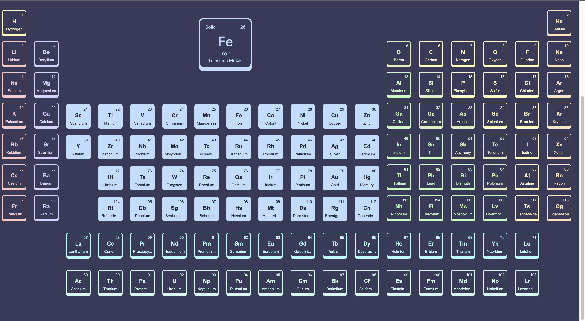
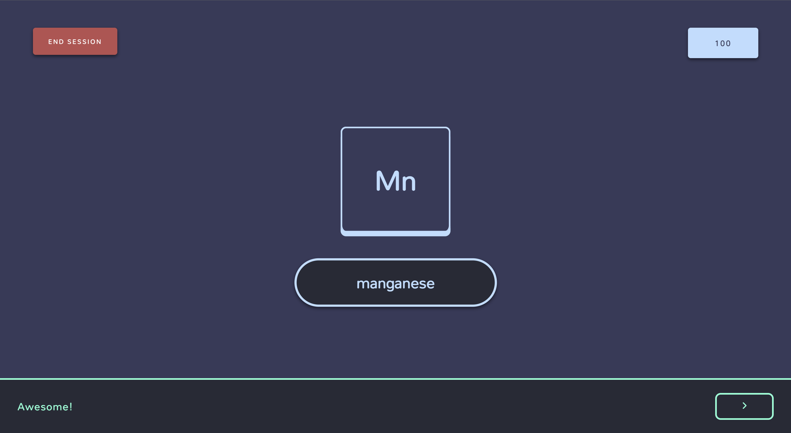

# Valentnost

## About the project
Valentnost is a single page web app that helps with the memorization of the names and symbols of the elements of the periodic table. The project was built with React, Redux, and CSS3.

## A quick glance

Interactive periodic table

  

Practice session

## Demo
The project is live and can be viewed at https://valentnost.app

## Dependencies
- React (17.0.2)
- React Router (5.3.0)
- React-Redux (7.2.6)
